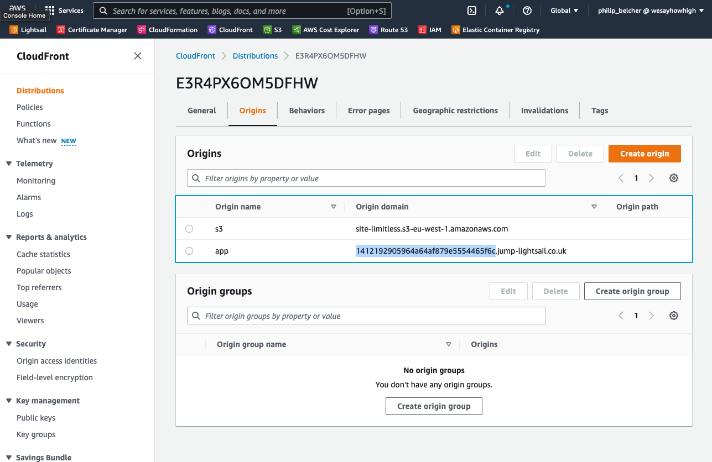

# Shutting Down
There are times when you may need to shut down a website - for example, if a client has left.

This normally involves deleting all resources associated with the website except for the Project in Semaphore (it doesn't cost us anything, whereas AWS resources can - plus it's a reference for any ENV variables which may be hard to retrieve in future) and taking a backup of the database - just in case.

Here are the steps to follow if you are asked to fully shut down a website.

:::note

Don't forget to check for UAT/Staging/Alternative versions of the website you're deleting!

Simply follow all of these steps for each website instance (however, you do **not** need to backup the database of any UAT/Staging/Alternative site)

:::

## [Lightsail](https://lightsail.aws.amazon.com/ls/webapp/home/instances) 

Find the website Lightsail and click the Delete tab and click the red **Delete instance** button and confirm any messages.

:::note

You should also check the Lightsail **Snapshots** for that website and delete them too as they incur costs.
Deleting the Lightsail **does not delete the snapshots**.

You can find all snapshots in the Snapshots tab of the Lightsail homepage

:::

## Database

You should connect to the database of the website in question using your SQL client of choice and export all of the tables except the `system_event_logs` (it can grow quite large).

Once downloaded, upload the sql dump file to our Microsoft Teams Developers Team to `Files/Backups/SITENAME/mysql-dump.sql` for safe keeping.

You can then delete the database for the website.

Remember to also delete the database user for the website,

## [S3 Bucket](https://s3.console.aws.amazon.com/s3/buckets?region=eu-west-1&region=eu-west-1)

To delete the S3 bucket for the associated website, you first need to empty it.

On the Buckets list view, find the bucket you wish to delete, select the radio button next to it, and click the **Empty** button.
This will take you to a new page where you have to confirm your action by typing `Permanently delete` into the input box and confirming.

If there is a `/logs` folder present (meaning CloudFront logging was likely enabled) then this may take **an obscene amount of time**

Once completed, you will then need to visit the overall Buckets list view again, find the bucket you wish to delete, select the radio button next to it, and click the **Delete** button and following the steps.

## [IAM Users](https://us-east-1.console.aws.amazon.com/iamv2/home?region=us-east-1#/users)

Most sites will likely have 2 IAM users associated to them:

1. A `site-sitename` user - used by the app for accessing the S3 bucket
2. A `semaphore-sitename` user - used by Semaphore for pushing Docker images to the Elastic Container Registry (ECR)

Both will need to be found in the IAM Users list view and deleted.

## [Elastic Container Registry (ECR)](https://eu-west-1.console.aws.amazon.com/ecr/repositories?region=eu-west-1)

There will be a private ECR repository for the website. Simply find it in the list, select the radio button beside its name and click the **Delete** button, confirming it in the popup.

## [CloudFormation Stack](https://eu-west-1.console.aws.amazon.com/cloudformation/home?region=eu-west-1#/stacks)

:::note

Not every website will have a CloudFormation Stack. 

Simply skip this step if you can't find one

:::

CloudFormation is responsible for creating/updating/deleting the CloudFront Distribution and Route53 Record for the `*.jump-lightsail.co.uk` domain that gets created internally.

If your site has a Stack, find it in the list and press the **Delete** button, confirming it in the popup.

If you delete the stack, then this will also trigger an automatic delete of:
- The CloudFront Distribution
- The Route 53 `*.jump-lightsail.co.uk` DNS record

Therefore you can skip those sections below.

## [CloudFront Distribution](https://us-east-1.console.aws.amazon.com/cloudfront/v3/home?region=eu-west-1)

:::note

If you deleted the **CloudFormation Stack** then you can skip this step as the CloudFront Distribution will have already been deleted

:::

Find the relevant CloudFront Distribution on the list page by searching for the URL of the website (it will be listed in the `aliases` column).

### Find the Route 53 Record Name before Deleting CloudFront Distribution

You want to find the name of the `*.jump-lightsail.co.uk` DNS record before you delete the CloudFront Distribution.

To find this, click on the ID of the CloudFront Distribution to go to the detail page and click on the Origins tab.

You'll see a list of the S3 bucket origin (named `s3`) and the lightsail origin (named `app`).
Under the `Origin domain` column you'll see a long GUID before the `.jump-lightsail.co.uk` part - make note of this so you can [delete it later](#route-53-lightsail-record)

### Deleting the CloudFront Distribution

Return to the CloudFront Distribution list page, find your Distribution again, click the checkbox beside your Distribution and click the **Disable** button first (you can't Delete straight away).

The Distribution will update to a `Disabled` state eventually, at which point you can click the checkbox beside your Distribution again and this time click the **Delete** button

## [Route 53 Lightsail Record](https://us-east-1.console.aws.amazon.com/route53/v2/hostedzones#ListRecordSets/Z2ZQ5RLAJ9ZYAP)

:::note

If you deleted the **CloudFormation Stack** then you can skip this step as the Route 53 record will have already been deleted

:::

Hopefully you kept a note of the GUID of the `.jump-lightsail.co.uk` from [the previous step](#find-the-route-53-record-name-before-deleting-cloudfront-distribution).

If not, hopefully you haven't deleted the Lightsail yet and have access to its IP Address.

If also not, then just skip this step and think about what you've done. It's not the end of the world.

Simply visit the Route 53 Hosted Zone for **jump-lightsail.co.uk**, find the relevant A Record either by GUID or IP address, click the checkbox and click the **Delete** button.

## [SSL Certificate](https://us-east-1.console.aws.amazon.com/acm/home?region=us-east-1#/certificates/list)

Find your website in the list, click the checkbox beside it and then click the **Delete** button, confirming it in the popup.

## [Postmark Account](https://postmarkapp.com/)

Once a site has been shut down, you should remove it from Postmark as it will be running periodic checks on the DNS DKIM record and will send emails complaining that it can't verify it.

Simply go to the [Server](https://account.postmarkapp.com/servers) and select the server your are removing. Click on **Settings** and then **Delete server**.

Then, go to [Sender Signatures](https://account.postmarkapp.com/signature_domains) and click the bin against the signature you are removing to delete it.