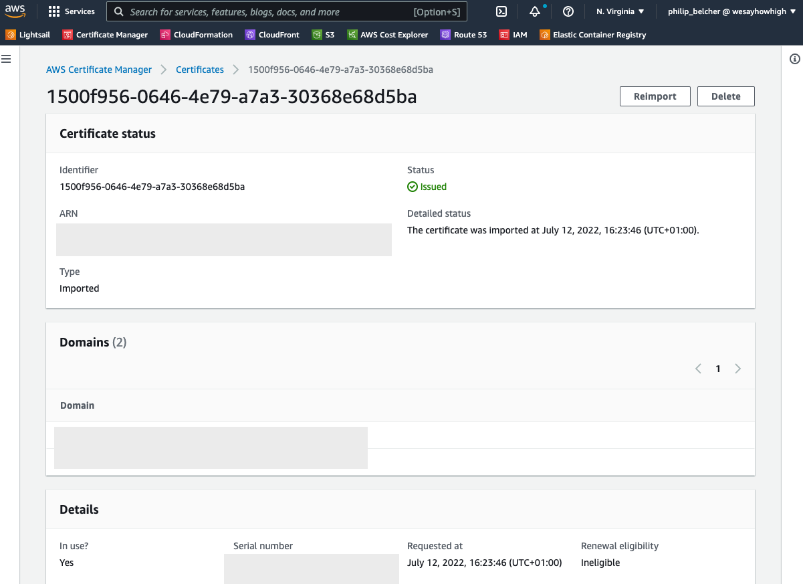

# Renewing an SSL Certificate

There are currently 2 options for renewing an SSL Certificate. Depending on if it is a:
- [Free Amazon Certificate](#renewing-a-free-amazon-certificate)
- [Paid for 3rd Party SSL](#renewing-a-3rd-party-certificate)

:::info

Certificates and CloudFront Distributions are the only sections of the AWS console you want to be in US-EAST-1 (N. Virginia).

Everything else in AWS needs to be in EU-WEST-1 (Ireland)

:::

## Renewing a Free Amazon Certificate

Amazon Free Certificates are automatically renewed by Amazon and automatically applied to the Cloudfront Distribution.

You shouldn't have to do anything to renew them.

However, if you can see Amazon hasn't renewed the certificate, the most likely cause is the [DNS records that were created](./installing#requesting-a-free-amazon-certificate) when the Certificate was initially requested have **been deleted**. Sometimes a client may remove these DNS records believing they're no longer required.

These records will need re-adding. See [Requesting a Free SSL Certificate](./installing#requesting-a-free-amazon-certificate) for the steps.

## Renewing a 3rd Party Certificate

The easiest way to renew a 3rd party certificate is by finding the existing one currently in use and using the **Reimport** feature to override it.

You _can_ install the new one separately (following the steps from [Installing a Paid for 3rd Party SSL](#installing-a-3rd-party-certificate)) but this will mean you now have an additional step: Updating the CloudFront distribution with the new Certificate - or ideally, updating the CloudFormation Stack if one exists.

Therefore, we recommend you follow the **ReImporting** steps below

### ReImporting

1. Visit the AWS Certificate Manager once logged into the AWS Console.

2. Ensure you are in US-EAST-1 (N. Virginia) by selecting the region selector.

3. Find the current Certificate in the list and click it to go to the detail page

    

4. Click the **Reimport** button 

5. Paste in the new Certificate Body, Private Key and Certificate Chain and click **Next**

6. Verify the information is correct (you should have matching domains but a greatly increased expiry date) and click **Continue**

7. After some seconds/minutes the Certificate will start propagating. 

8. View the website in Incognito mode and inspect the Certificate to ensure the new expiry date is there. 