# Manipulators

Using the **Images Plugin** (with a little help from [Glide](https://glide.thephpleague.com/)), you are able to alter any image you pass to it using a set of **manipulators**. Each of these is accessible by passing the correct attributes in your twig file.

```htm title='your-twig-file.htm'

```


## Size

### Width

Sets the width of the image in pixels

```htm title='your-twig-file.htm'

```

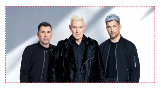

### Height

Sets the height of the image in pixels

```htm title='your-twig-file.htm'

```

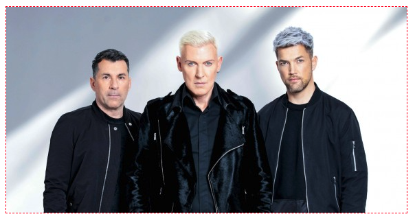

### Fit

Sets how the image is fitted within the aforementioned dimensions. This accepts a number of different options: 

#### ```contain```
This is the default option. It resizes the image to fit within the width and height boundaries without cropping, distorting or altering the aspect ratio.

#### ```max```
This will do the same as contain, while also not increasing the size of the image if it is smaller than the output size.

#### ```fill```
This resizes the image to fit within the width and height boundaries without cropping or distorting the image, and the remaining space is filled with the background colour.

#### ```fill-max```
This resizes the image to fit within the width and height boundaries without cropping, but will upscale the image if it's smaller. The finished image will have remaining space on either the height or width (unless the aspect ratio is the same). The remaining space will be filled with the background colour.

#### ```stretch```
This stretches the image to fit the constraining dimensions exactly. The end result will not maintain the aspect ratio of the initial image.

#### ```crop```
This resizes the image to fill with width and height boundaries and crops any excess image data. The resulting image will match the width and height constraints without distorting the image. More information can be found on this in the [Crop](#crop-1) section.

```htm title='your-twig-file.htm'

```

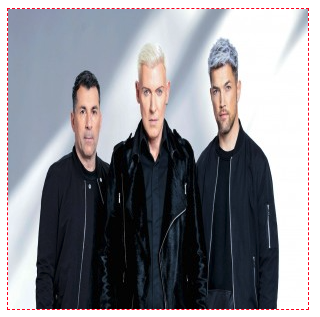

## Crop

### Fit

#### Crop

When used in conjunction with **size**, this resizes the image to the dimensions provided and removes any excess image data surrounding it. It allows you to have an image fit specific proportions without distorting it.

```htm title='your-twig-file.htm'

```


#### Crop Position

You can state where the image is cropped by adding a crop position. This accepts ```crop-top-left```, ```crop-top```, ```crop-top-right```, ```crop-left```, ```crop-center```, ```crop-right```, ```crop-bottom-left```, ```crop-bottom```, ```crop-bottom-right```. If not included, ```crop-center``` is the same as ```crop```.

```htm title='your-twig-file.htm'

```

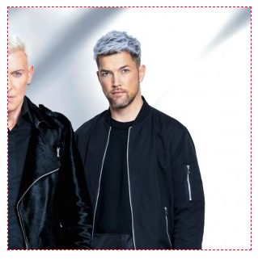

#### Crop Focal Point

You can also be more specific about the exact crop position by using a focal point. 

```htm title='your-twig-file.htm'

```

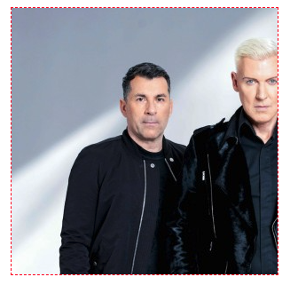

### Crop

This crops the image to specific dimensions before doing any other resize operations. Must be in the format of ```width,height,x,y```.

```htm title='your-twig-file.htm'

```

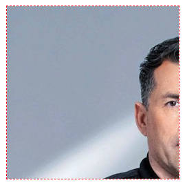

## Encode

### Quality

This defines the quality of the image. You can use values between ```0``` and ```100``` with the default being ```90```. It's worth noting that this is only relevant if the format is set to ```jpg```, ```pjpg```, ```webp``` or ```avif```.

```htm title='your-twig-file.htm'

```

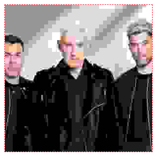

### Format

This changes the format of the rendered image. By default, it is set to ```jpg```, but can be set to ```jpg```, ```pjpg```, ```png```, ```gif```, ```webp``` or ```avif```.

```htm title='your-twig-file.htm'

```

## Others
In addition to the above, there's also many other options available to us should we need them:

### Orientation - ```or```
Rotates the image accepting ```auto```, ```0```, ```90```, ```180```, ```270``` as parameters
```htm title='your-twig-file.htm'

```

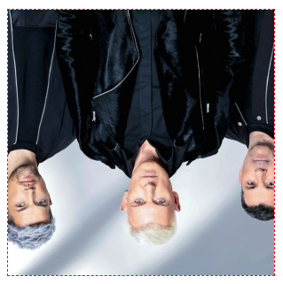

### Brightness - ```bri```
Adjusts the image brightness accepting values between ```-100``` and ```+100``` as parameters
```htm title='your-twig-file.htm'

```
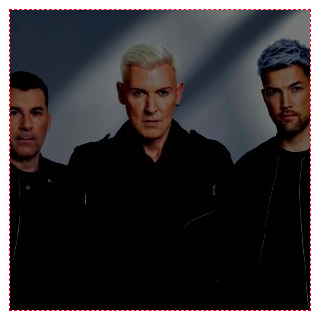

### Contrast - ```con```
Adjusts the image contrast accepting values between ```-100``` and ```+100``` as parameters
```htm title='your-twig-file.htm'

```
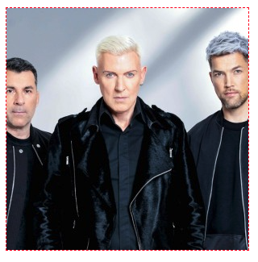

### Gamma - ```gam```
Adjusts the image gamma accepting values between ```0.1``` and ```9.99``` as parameters
```htm title='your-twig-file.htm'

```
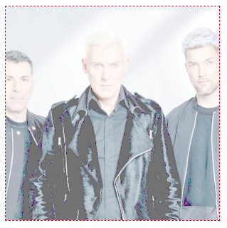

### Sharpen - ```sharp```
Sharpens the image accepting values between ```0``` and ```100``` as parameters
```htm title='your-twig-file.htm'

```
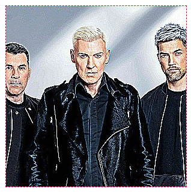

### Blur - ```blur```
Sharpens the image accepting values between ```0``` and ```100``` as parameters
```htm title='your-twig-file.htm'

```
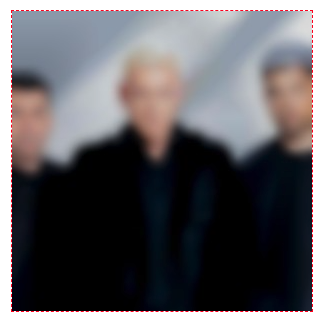

### Pixelate - ```pixel```
Applies a pixelation effect to the image accepting values between ```0``` and ```1000``` as parameters
```htm title='your-twig-file.htm'

```
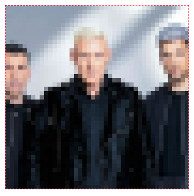

### Filter - ```filt```
Applies a filter effect to the image accepting either ```greyscale``` or ```sepia``` as parameters
```htm title='your-twig-file.htm'

```
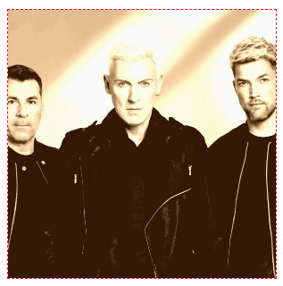

### Background - ```bg```
Sets the background colour of the image. (For a full list of all accepted colour names and codes, please look at [Glide's official colours list](https://glide.thephpleague.com/2.0/api/colors/))
```htm title='your-twig-file.htm'

```
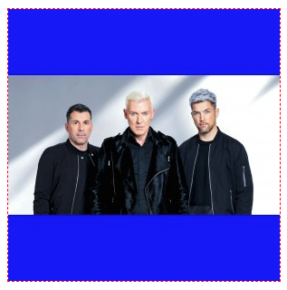

### Border - ```border```
Applies a border to the image, the required format being ```width,colour,method```. (The method parameter sets how the border will be displayed. You can pick between ```overlay```, ```shrink``` and ```expand```)
```htm title='your-twig-file.htm'

```
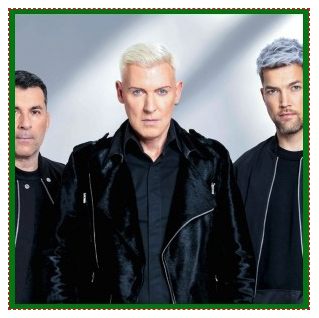

### Icon - ```icon```
One that we actually created ourselves if you can believe that. This combines a couple existing manipulations to give you a resized version of the image with a white background filling in the gaps. You pass the desired width and height as parameters (```icon(300,300)```)
```htm title='your-twig-file.htm'

```
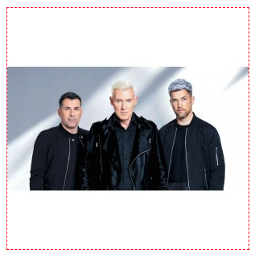
