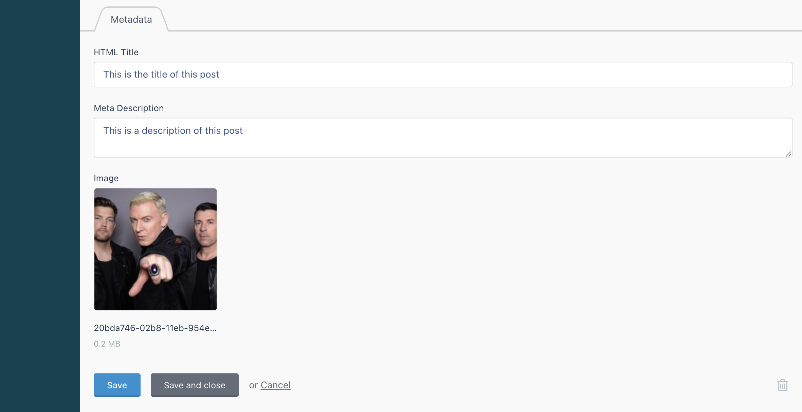

# Metadata Plugin

## Introduction

The JUMP Metadata Plugin allows you to add additional meta information to the pages you build.

## Installation

Type `composer require jump/oc-metadata-plugin` into your project root terminal.


## Repository

[Github](https://github.com/wesayhowhigh/oc-metadata-plugin)


## Usage

### Supported Meta Fields

The meta information you can define for a page is as follows:
- General Meta Information
  - HTML Title
  - Meta Description
  - Canonical Tag (the URL that represents the main version of the page)
- Open Graph
  - Open Graph Title
  - Open Graph Description
- Twitter Card
  - Twitter Card Title
  - Twitter Card Description
  
### In The Backend
#### Within The Pages Plugin

Once installed, you can set the meta information for any page defined within the **Pages Plugin**.

You can see and edit this data by clicking into the page within the Pages Plugin and clicking the **Meta** tab above the page content.

#### Within Custom Plugins

To add the metadata fields to your custom plugin models, use the **Metadatable** trait and make sure you include the **getDefaultMetadata()** method stub.

```php title="/plugins/app/blog/models/Post.php"
<?php

  namespace App\Blog\Models;
  
  use Jump\Metadata\Traits\Metadatable;
  use Model;
  use Jump\Images\Classes\Glide;
  
  class Post extends Model
  {
    use Metadatable;
    
    ...
    
    protected function getDefaultMetadata(): array
    {
      // TODO: Implement getDefaultMetadata() method.
    }
  }
```

This is where you will state which fields from the database will populate each of the metadata attributes, should a user leave them blank:

```php title="/plugins/app/blog/models/Post.php"
    protected function getDefaultMetadata(): array
    {
      return [
        'title' => $this->title,
        'description' => $this->introduction,
        'image' => Glide::apply($this->image, [
          'w' => 1200,
          'h' => 630,
          'fit' => 'crop',
          'fm' => 'pjpg',
          'q' => 90,
        ])
      ];
    }
  }
```

Once your model has been set up to use Metadatable, go to the Plugin in the CMS and you will see the meta fields are now available to be edited:



### On The Front End
By default, in the base project you can find the front end usage of the Metadata plugin in the **meta.htm** file.

Initially, a range of variables are set, providing various fallbacks should certain pieces of data not be set.

```htm title="/themes/app/partials/meta.htm"











```

Once set, they are then assigned to the appropriate meta tags: 

```htm title="/themes/app/partials/meta.htm"
<title>{{ displayTitle }} | {{ site('name') }}</title>
<meta name="description" content="{{ stripTags(this.page.meta_description) }}">

<link rel="canonical" href="{{ url(this.page.meta_canonical ?: getCanonicalLink()) }}" />


<meta name="robots" content="noindex">


<meta name="twitter:image" content="{{ displayTwitterCardImage }}">
<meta name="twitter:card" content="summary_large_image">
<meta name="twitter:site" content="{{ displayTwitterCardTitle }}">
<meta name="twitter:title" content="{{ displayTwitterCardTitle }}">
<meta name="twitter:description" content="{{ stripTags(displayTwitterCardDescription) }}">
<meta name="twitter:creator" content="@wesayhowhigh">

<meta property="og:title" content="{{ displayOpenGraphTitle }}" />
<meta property="og:type" content="article" />
<meta property="og:description" content="{{ stripTags(displayOpenGraphDescription) }}" />
<meta property="og:image" content="{{ displayOpenGraphImage }}"/>
<meta property="og:site_name" content="{{ site('name') }}" />
<meta property="og:url" content="{{ getCanonicalLink() }}" />

```
