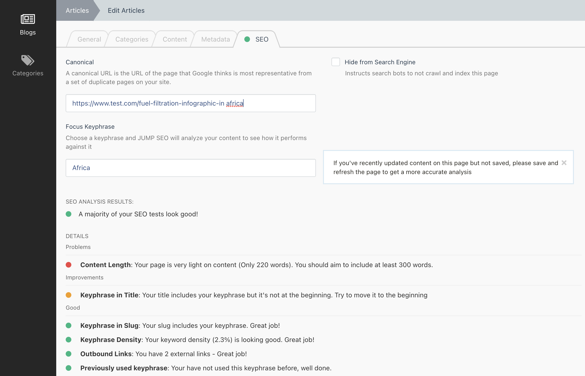

# SEO

## Introduction




The SEO functionality provided by the Metadata Plugin is based upon the [Yoast SEO Plugin](https://yoast.com/features/) for WordPress.

It is designed to scan page content for a number of factors and give the user a RAG (Red, Amber, Green) rating.

:::tip

As of v3.19.0 of the JUMP Pages Plugin, Static Pages are integrated with this new SEO functionality.
You therefore will need to [add the new tags to your pagesections yaml files](#add-new-tags-to-pagesection-yaml-files) otherwise your Pages will rank poorly as the Plugin will not know what is content or hyperlinks!

:::

The SEO section also provides the following features:


### Canonical URL

A canonical URL is the URL of the page that Google thinks is most representative from a set of duplicate pages on your site.

#### Example Usage
```html title="/themes/app/partials/meta.htm"
<link rel="canonical" href="{{ url(this.page.meta_canonical ?: getCanonicalLink()) }}" />
```


### Hide From Search Engine

Instructs search bots to not crawl and index this page

#### Example Usage
```html title="/themes/app/partials/meta.htm"

    <meta name="robots" content="noindex">

```


## Integrating SEO

Similar to the Metadata functionality, the SEO functionality has an `Seoable` Trait and an `Seoable` Interface.

### Add Code to your Model

Add the Trait, Interface and the required methods to the Model you wish to display the SEO panel on in the backend form

#### Required Methods

```php
/**
 * Fetch the HTML Title of this entity. Try to use whatever gets used
 * as the HTML Page Title
 *
 * @return string
 */
public function getTitleForSeo(): string;


/**
 * Fetch the slug for this entity
 *
 * @return string
 */
public function getSlugForSeo(): string;


/**
 * Fetch the entire content for this entity.
 * If you use JUMP Page PageSections as the entities main content, then loop
 * over all Text-type PageSections and concatenate into 1 string.
 *
 * If you have multiple fields that make up the entities Page content, then
 * please concatenate them all together
// highlight-next-line
 * There are helper methods available for this in Jump\Metadata\Classes\Seo\SeoHelpers
 *
 * @return string
 */
public function getContentForSeo(): string;

/**
 * An array of all hyperlinks (internal and outgoing) that could be rendered
 * on this entities Page
 *
 * If you use JUMP Page PageSections as the entities content, then loop
 * over all PageSections that could contain links and fetch their URLS
 *
 * If your Model has fields for hyperlinks that get rendered on the page
 * then include those too
// highlight-next-line
 * There are helper methods available for this in Jump\Metadata\Classes\Seo\SeoHelpers
 *
 * @return array
 */
public function getHyperlinksForSeo(): array;
```

#### Example
```php title="Example Model class"
<?php

namespace App\Blog\Models;

use Jump\Metadata\Classes\Seoable;
use Jump\Metadata\Traits\Seoable as SeoableTrait;

class Article extends Model implements Seoable
{
    use SeoableTrait;

    ...
    /**
     * @inheritDoc
     */
    public function getTitleForSeo(): string
    {
        if ($this->metadata->title) {
            return $this->metadata->title;
        }

        return $this->title;
    }

    /**
     * @inheritDoc
     */
    public function getSlugForSeo(): string
    {
        return $this->slug;
    }

    /**
     * @inheritDoc
     */
    public function getHyperlinksForSeo(): array
    {
        // In this example, $this->content is a $jsonable column containing JUMP Page Pagesections
        
        return SeoHelpers::getHyperlinksFromPageSections($this->content);
    }


    /**
     * @inheritDoc
     */
    public function getContentForSeo(): string
    {
        // In this example, $this->content is a $jsonable column containing JUMP Page Pagesections
        // and $this->introduction is a text column using an October textarea type
        
        $pageSectionData = SeoHelpers::getContentFromPageSections($this->content);
        $introData = $this->introduction;
        
        return $pageSectionData . ' ' . $introData;
    }
    ...
```

### Add new tags to PageSection YAML files

To ensure the SEO plugin can detect text content and link content inside your Pagesections, there are 2 new fields you can add to your `.yaml` files inside your PageSections fields or the Blocks within a Pagesection:

```yaml
seoContent: true
seoLinks: true
```

If you are using a simple field type such as `text` or `textarea` and expect the user to add basic text that gets rendered on the frontend, then simply add the `seoContent: true` tag and the entire content of the field will be treated as content.

If you are using a simple field type such as `text` and expect the user to add a link (such as a Call To Action link) then just add `seoLinks: true` tag and the entire content of the field will be treated as a URL.

If both tags are present on a field, then it is treated as HTML and Links will be detected by scanning for **anchor tags**. Use this for the `richeditor` field type if you add the Links to the toolbarButtons value.

```yaml title="Example Pagesection: app/site/pagesections/text/fields.yaml"

fields:
    
    title:
        label: Title
        type: text
        comment: Renders a title as a h2 tag
        seoContent: true
        
    callToActionLabel:
        label: Call to Action Label
        type: text
        comment: Renders a button on the frontend. This will be the label
        seoContent: true
        
    callToActionLink
        label: Call to Action URL
        type: text
        comment: Renders a button on the frontend. This will be the url
        seoLinks: true
        
    text:
        label: Text Content
        type: richeditor
        comment: Renders HTML raw
        seoContent: true
        seoLinks: true
```