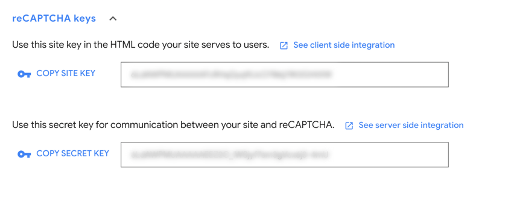
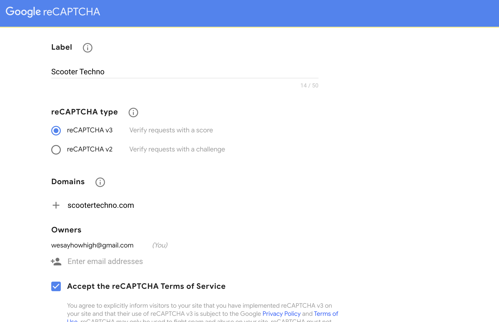

# reCAPTCHA Plugin

## Introduction
The **reCAPTCHA Plugin** allows you to add [Google's reCAPTCHA](https://www.google.com/recaptcha/about/) service to your forms, making sure any user that submits the form is a legitimate user.

## Installation
Type `composer require jump/oc-recaptcha-plugin` into your project root terminal.

## Repository
[Github](https://github.com/wesayhowhigh/oc-recaptcha-plugin)

## Configuration
Depending on what version of reCAPTCHA you wish to use, there's a few different ```env``` variables you can set:

### Version
```dotenv title=".env"
JUMP_RECAPTCHA_DRIVER=V3
```
This sets the version of reCAPTCHA you will be using. By default, this will be version 3 (```V3```), but version 2 (```V2```) can also be implemented.

### Keys
```dotenv title=".env"
JUMP_RECAPTCHA_PUBLIC_KEY=PUBLIC-KEY-ASSIGNED-BY-GOOGLE
JUMP_RECAPTCHA_PRIVATE_KEY=PRIVATE-KEY-ASSIGNED-BY-GOOGLE
```
These are the keys you get from Google when setting up reCAPTCHA for your project. 



:::caution
Make sure you get the correct keys for the version of reCAPTCHA you intend to use.
:::
### Score Threshold

```dotenv title=".env"
JUMP_RECAPTCHA_THRESHOLD=0.5
```
When using version 3, Google assesses a user’s validity by assigning them a score ranging from **0.0** to **1.0** (with 0.0 being high risk/unlikely to be legitimate and 1.0 being low risk/likely to be legitimate).

This value sets the score that the user will have to beat in order to submit the form. A higher number makes the form more picky about whether it approves the user or not.

By default, this is set to 0.5, and it’s very unlikely it would need to be anything else.

## Usage
### Setting it up in Google


Firstly, log in to your Google account, and go to the [**reCAPTCHA Admin Console**](https://www.google.com/recaptcha/admin). You can then click the **+** to register a new site.

Add a label, select which version you wish to use, and then list the domains you want to protect with your new reCAPTCHA property (if you select version 2, you will also need to select what version of the reCAPTCHA you wish to use).

Then you just click **Submit** and you are good to go!

### Adding it to Your Form
To add reCAPTCHA to your form, you would simply add the following just before the submit button:

```htm title='contact-form.htm'
{{ recaptcha() }}

<p data-validate-for="g-recaptcha-response"></p>
```

This markup tag will bring through all the code needed to add a reCAPTCHA field to your form:

**As rendered by Version 3:**
```htm  
<input type="hidden" name="g-recaptcha-response" class="g-recaptcha-response-placeholder">

<script>
    if (!document.querySelector('script[src^="https://www.google.com/recaptcha/api.js"]')) {
        window.resetRecaptcha = window.resetRecaptcha ? window.resetRecaptcha : function resetRecaptcha() {
            var pageURL = window.location.href.split('?')[0].split('#')[0];
            var action = pageURL.substr(pageURL.lastIndexOf('/') + 1).replace('/', '').replace(/[^a-zA-Z0-9]/g,'_');
            grecaptcha.execute('PUBLIC-KEY-ASSIGNED-BY-GOOGLE', { action: action })
                .then(function (token) {
                    var responses = document.getElementsByClassName('g-recaptcha-response-placeholder');

                    for (let i = 0; i < responses.length; i++) {
                        responses[i].value = token;
                    }
                });
            }

            window.onloadRecaptchaCallback = window.onloadRecaptchaCallback ? window.onloadRecaptchaCallback : function onloadRecaptchaCallback() {
            grecaptcha.ready(function() {
                resetRecaptcha();
                var oneHundredSeconds = 100000;

                // reCAPTCHAs expire after 120 seconds, so this forces a refresh just before that
                setInterval(resetRecaptcha, oneHundredSeconds);
            });
        }

        var newScript = document.createElement('script');
        newScript.src = 'https://www.google.com/recaptcha/api.js?onload=onloadRecaptchaCallback&render=PUBLIC-KEY-ASSIGNED-BY-GOOGLE';
        newScript.async = true;
        newScript.defer = true;

        document.head.appendChild(newScript);
    }
</script>
```
**As rendered by Version 2:**
```htm 
<script src="https://www.google.com/recaptcha/api.js" async defer></script>

<div class="g-recaptcha"
   data-sitekey="PUBLIC-KEY-ASSIGNED-BY-GOOGLE"
   data-theme="light"
   data-type="image"
   data-size="normal"
   data-tabindex="0"
></div>
```
Then, to enable the validation on form submission, and the following to the ```rules()``` method in your form's **Action class**:

```php title='/plugins/app/site/actions/SendEnquiry.php'
<?php

namespace App\Site\Actions;

use Mail;
use Jump\Query\FormAction;
use Jump\Query\ParamBag;

class SendEnquiry extends FormAction
{
    protected function rules()
    {
        return [
            'g-recaptcha-response' => 'recaptcha',
        ];
    }
    
    ...
}
```

You would then add the following ```data-request-complete``` attribute to your ```form``` tag to reset the reCAPTCHA after a failed validation:

```htm title='contact-form.htm'
    <form
        class="c-Form__form"
        data-request="{{ actions.submit }}"
        data-request-validate
        data-request-flash
        method="post"
        data-request-complete="resetRecaptcha()"
    >
    ...
```