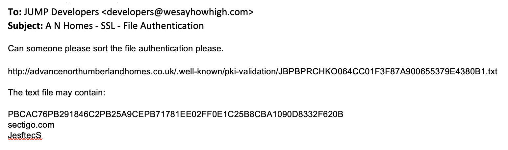
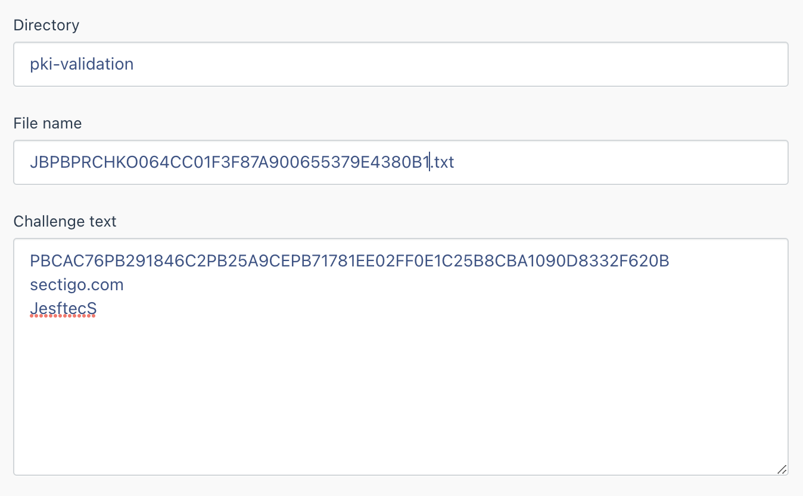

# SSL Plugin

## Introduction

The **SSL Plugin** provides ability to install a SSL certificate for the website.

When enabled, the site will always redirect from http to https.

The **SSL Plugin** is included within the base repo. 

The SSL plugin is used to update SSL certificates that require File Authentication to validate the domain.

## Installation

```bash
composer require jump/oc-ssl-plugin
```

## Repository

[Github](https://github.com/wesayhowhigh/oc-ssl-plugin)

## Usage
Create a file on the server in the public directory to authenticate ownership of domain so an SSL certificate can be installed. 

## Setup
Via October CMS backend, navigate to Settings > SSL Challenge. 

## SSL File Authentication email
An example of an SSL file authentication email that is received when requesting a certificate. 



## SSL File Authentication CMS
Via Backend settings, break the URL and text down in to the following fields

1. Directory
2. File name
3. Challenge text


